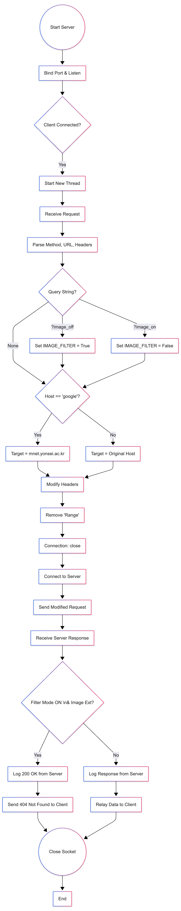
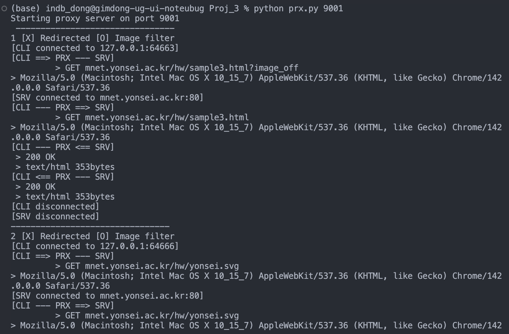
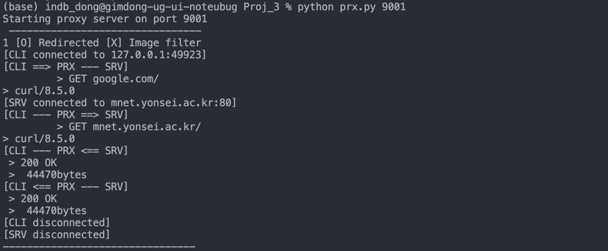

# Computer Network Proj. 3: HTTP Proxy Server

---

## CAS4106, 2023122004 김동욱

# 1. Introduction & Environment

본 프로젝트의 목표는 Ubuntu 환경에서 소켓 프로그래밍을 통해 HTTP 프록시 서버를 구축하여 2가지 기능을 제공하는 것입니다. 첫 번째 기능은 “google”을 포함하는 모든 url을 [`http://mnet.yonsei.ac.kr/`](http://mnet.yonsei.ac.kr/)로 리다이렉팅하는 기능이며, 두 번째 기능은 쿼리스트링을 통해 이미지 필터를 ON/OFF할 수 있는 기능입니다.

### 1.1 Development Environment

본 보고서에 사용된 개발 환경 및 프로그래밍 언어는 다음과 같습니다.

- **Operating System:** macOS 14.6.1 (23G93) (Developed on macOS, compatible with Ubuntu 20.04 LTS as required)
- **Programming Language:** Python 3.11
- **Libraries:** Standard Python Libraries (`socket`, `sys`, `threading`)
  - _No 3rd-party libraries or frameworks were used._

### 1.2 References

코드 작성 시 참고한 문서들입니다.

1. **Python Socket Programming:**
   - _Python 3 Documentation - socket:_ [https://docs.python.org/3/library/socket.html](https://docs.python.org/3/library/socket.html)
   - _Disable the persistent HTTP Connection_ : [https://www.internalpointers.com/post/making-http-requests-sockets-python.html](https://www.internalpointers.com/post/making-http-requests-sockets-python.html)
2. **Python Concurrency (Multi-threading):**
   - _Python 3 Documentation - threading:_ [https://docs.python.org/3/library/threading.html](https://docs.python.org/3/library/threading.html)
3. **HTTP Protocols & Headers:**
   - _MDN Web Docs - HTTP Headers:_ [https://developer.mozilla.org/en-US/docs/Web/HTTP/Headers](https://developer.mozilla.org/en-US/docs/Web/HTTP/Headers)

# 2. Program Flow Chart



### Block 1: Connection & Concurrency Handling (Steps 1~3)

- **Description:**
  - 소켓을 생성하고 포트에 바인딩한 뒤, 무한 루프 내에서 `accept()`를 호출하여 클라이언트의 연결을 대기합니다.
  - 연결이 수락되면 `threading.Thread`를 사용하여 즉시 새로운 스레드를 생성하고, `handle_client` 함수로 제어권을 넘깁니다.
- **Implementation Reason:**
  - 프록시 서버는 다수의 클라이언트 요청(HTML, 이미지 등)을 동시에 처리해야 합니다. 단일 스레드로 구현할 경우 앞선 요청 처리가 끝날 때까지 뒤의 요청이 블로킹되는 문제가 있어, 동시성(Concurrency)을 보장하기 위해 멀티 스레딩 방식을 채택했습니다.

### Block 2: Request Parsing & Modification (Steps 4~11)

- **Description:**
  - **Parsing:** 수신된 패킷을 디코딩하여 HTTP Method, URL, Version을 분리하고 헤더를 파싱합니다.
  - **Dynamic Filtering:** URL의 쿼리 스트링(`?image_on/off`)을 감지하여 전역 변수 `IMAGE_FILTER_MODE`를 실시간으로 업데이트합니다.
  - **Redirection:** Host 이름에 "google"이 포함된 경우, 목적지 주소(`target_host`)를 강제로 `mnet.yonsei.ac.kr`로 변경합니다.
  - **Header Modification:** `Range` 헤더를 제거하고, `Connection` 헤더를 `close`로 변경하여 재조립합니다.
- **Implementation Reason:**
  - **Range Removal:** 브라우저가 대용량 이미지에 대해 부분 요청(`Range` 헤더)을 보낼 경우 서버가 `206 Partial Content`를 응답합니다. 하지만 과제 예시 로그와 동일한 `200 OK` 응답을 유도하고 정확한 차단 로직을 수행하기 위해, `Range` 헤더를 삭제하여 전체 데이터를 요청하도록 강제했습니다.

### Block 3: Server Communication & Log Buffering (Steps 12~13)

- **Description:**
  - 수정된 요청을 타겟 서버로 전송하고 응답을 수신합니다.
  - 로그가 섞이는 것을 방지하기 위해, 각 스레드는 `print()`를 즉시 호출하지 않고 지역 변수(Local Buffer)에 로그 텍스트를 누적합니다.
- **Implementation Reason:**
  - 멀티 스레드 환경에서 여러 스레드가 동시에 콘솔에 출력하면 로그 라인이 서로 섞여 가독성이 떨어집니다. 이를 방지하고 과제의 "Precise Logs" 요구사항 을 만족시키기 위해, 요청 처리가 끝나는 시점에 로그를 원자적(Atomically)으로 출력하는 전략을 사용했습니다.

### Block 4: Fetch-then-Block Strategy (Steps 14~15)

- **Description:**
  - 서버로부터 데이터를 수신할 때마다 클라이언트에게 바로 전달하지 않고 필터링 조건을 먼저 검사합니다.
  - **Logic:** `IMAGE_FILTER_MODE`가 켜져 있고(`True`) 파일 확장자가 이미지인 경우, 서버 응답(200 OK)은 로그에만 기록하고 클라이언트에게는 `404 Not Found`를 전송한 뒤 연결을 종료합니다.
- **Implementation Reason:**
  - 효율성을 위해서는 요청 단계에서 차단하는 것이 좋으나, "서버로부터 200 OK를 받은 로그"를 먼저 출력하고 "클라이언트에게 404를 보낸 로그"를 출력해야 하는 과제 예시 를 정확히 따르기 위해, **서버 통신 후 차단(Fetch-then-Block)** 방식을 구현했습니다.

---

# 3. Code Explanations

### Block 1: Multi-threading (line 234 ~ 240) & Atomic Logging Strategy (line 19 ~ 27)

```python
# Threading setup
client_handler = threading.Thread(
                target=handle_client,
                args=(client_sock, client_addr)
            )
client_handler.daemon = True
client_handler.start()

# Inside handle_client
def print_queue(_msg, is_last=False, req_num=0, redirecting=False, image_filter=False):
	nonlocal FINAL_LOG
  if is_last:
      # 마지막에 헤더를 맨 앞에 붙여서 완성
      header = f"{req_num} [{'O' if redirecting else 'X'}] Redirected [{'O' if image_filter else 'X'}] Image filter"
      FINAL_LOG = header + "\\n" + FINAL_LOG + _msg
  else:
      FINAL_LOG += _msg + "\\n"
```

- **Logic:** 메인 루프에서 `accept()`된 각 클라이언트 소켓을 별도의 스레드(`threading.Thread`)로 분리하여 처리했습니다.
- **Reason:** 프록시 서버는 동시에 여러 요청(HTML, CSS, JS, Images)을 처리해야 하므로, 단일 스레드로는 블로킹이 발생하여 속도가 느려집니다.
- **Solving Race Condition (Log Interleaving):** 멀티 스레드 환경에서 `print()`를 즉시 호출하면 여러 스레드의 로그가 뒤죽박죽 섞이게 됩니다. 이를 방지하기 위해 `FINAL_LOG`라는 지역 변수(Local Buffer)에 해당 요청의 모든 로그를 모아두었다가, 연결이 끝나는 시점에 **한 번에(Atomically)** 출력하는 방식을 채택했습니다. 이는 과제에서 요구하는 "Precise Log" 형식을 준수하기 위함입니다.

### Block 2: Request Parsing & Header Modification (line 98~107)

```python
# 1바이트 요청 (206 Partial Content) 문제를 해결하기 위해 Range 헤더를 삭제
lines_to_send = []
for line in lines:
    line_lower = line.lower()
    if line_lower.startswith("connection:"): continue
    if line_lower.startswith("range:"): continue
    lines_to_send.append(line)

lines_to_send.insert(1, "Connection: close")
modified_request_data = "\\r\\n".join(lines_to_send).encode('utf-8')
```

- **Logic:** 클라이언트가 보낸 요청 헤더 중 `Range` 헤더를 삭제하고, `Connection` 헤더를 강제로 `close`로 변경했습니다. 이후 변형된 요청 데이터를 사용하는 방식으로 구현을 마무리했습니다.
- **Reason (Persistent Connection):** 과제 명세서에 따라 Persistent Connection(Keep-Alive)을 구현하지 않아도 되므로, 복잡성을 줄이고자 매 요청마다 연결을 끊도록 `Connection: close`를 설정했습니다.
- **Reason (Range Header):** 브라우저는 대용량 이미지의 경우 `Range: bytes=0-0`과 같은 부분 요청(Partial Request)을 보냅니다. 이 경우 서버는 `206 Partial Content`를 응답하는데, 과제 예시 로그와 동일한 `200 OK` 응답을 유도하고 이미지를 확실하게 차단/허용하기 위해 `Range` 헤더를 제거하여 전체 데이터를 요청하도록 설계했습니다.

### Block 3: Dynamic Image Filtering (line 119 ~ 123) (Query String (line 67 ~ 72))

```python
query_string = "" # 예: ?image_on
if "?" in temp_url:
    parts_url = temp_url.split('?', 1)
    temp_url = parts_url[0]
    query_string = "?" + parts_url[1]

# ...

if "image_on" in query_string:
    IMAGE_FILTER_MODE = False
elif "image_off" in query_string:
    IMAGE_FILTER_MODE = True
```

- **Logic:** 요청 URL의 쿼리 스트링을 분석하여 전역 변수 `IMAGE_FILTER_MODE`를 변경합니다.
- **Reason:** 과제 요구사항인 동적 필터링을 구현하기 위함입니다. 이 변수는 모든 스레드가 공유해야 하므로 `global`로 선언하였습니다.

### Block 4: Fetch-then-Block Strategy for Image Filtering (line 140~189)

```python
# Judge if we should block the request
should_block = False
if IMAGE_FILTER_MODE and target_path.lower().endswith(image_extensions):
    should_block = True

# Receive response from server FIRST
while True:
	response_data = server_socket.recv(4096)
	# Processing the first response data ...

	# Log the server response (e.g., 200 OK)
	print_queue(f"[CLI --- PRX <== SRV]")
  print_queue(f" > {status_line}")
  print_queue(f" > {content_type} {content_length}bytes")

  # ...

	# THEN check blocking
	if should_block:
	  # [차단 시] 404 전송 및 로그
	  not_found_msg = "HTTP/1.1 404 Not Found\\r\\nContent-Type: text/plain\\r\\nContent-Length: 13\\r\\n\\r\\n404 Not Found"
	  client_socket.send(not_found_msg.encode('utf-8'))

	  print_queue(f"[CLI <== PRX --- SRV]")
	  print_queue(f" > 404 Not Found")
	  break # 루프 종료 (더 이상 데이터 안 보냄)
	# ...
```

- **Logic:** 이미지를 차단해야 하는 상황이라도, 즉시 차단하지 않고 **서버에 요청을 보내 응답 헤더를 먼저 받아온 후**에 차단 로직을 수행합니다.
- **Reason:** 효율성 측면에서는 요청을 보내지 않고 바로 차단하는 것이 좋지만, 과제 명세서의 로그 예시()를 보면 **"서버로부터 200 OK를 받은 로그"**가 먼저 출력되고, 그 후에 **"클라이언트에게 404를 보낸 로그"**가 출력됩니다. 이 로그 형식을 정확히 맞추기 위해 서버와 통신을 수행한 후 클라이언트에게만 거짓 정보(404)를 주는 방식을 선택했습니다.

---

# 4. Experimental Results & Analysis

### 4.1. Dynamic Image Filtering (with Query String)




- **Experiment:**
  - 클라이언트가 `http://mnet.yonsei.ac.kr/hw/sample3.html?image_off`를 요청했습니다.
  - 이후 웹 브라우저가 페이지 렌더링을 위해 내장된 이미지들(`image.jpg`, `yonsei.svg`)을 자동으로 요청했습니다.
- **Result Analysis:**
  1. **Mode Switching:** 첫 번째 요청 URL의 쿼리 스트링에서 `?image_off`를 감지하여 전역 변수 `IMAGE_FILTER_MODE`를 `True`로 설정했습니다. 로그 헤더에 `[O] Image filter`가 표시된 것을 통해 모드가 정상적으로 활성화되었음을 확인할 수 있습니다.
  2. **Range Header Removal:** 브라우저는 효율성을 위해 대용량 이미지에 대해 `Range` 헤더(부분 요청)를 전송하지만, 과제 명세서의 로그 예시와 동일한 `200 OK` 응답을 유도하기 위해 프록시 내부에서 `Range` 헤더를 제거하고 서버로 요청을 보냈습니다. 그 결과 서버로부터 `206 Partial Content`가 아닌 `200 OK` 응답을 수신했습니다.
  3. **Fetch-then-Block Strategy:**
     - **Server-Side Log:** `[CLI --- PRX <== SRV]` 로그를 보면 `200 OK` 상태 코드와 함께 전체 이미지 파일 크기(예: 671253 bytes)를 정상적으로 수신했음을 확인할 수 있습니다.
     - **Client-Side Log:** 그러나 `[CLI <== PRX --- SRV]` 로그에서는 `404 Not Found`가 기록되었습니다. 이는 필터 모드가 활성화(`True`)되어 있고 파일 확장자가 이미지일 경우, 서버에서 받아온 데이터를 버리고 클라이언트에게는 404 에러를 전송하는 차단 로직이 정확히 동작했음을 증명합니다.

### 4.2. Disabling Image Filtering (Reverting to Normal Mode)


- **Experiment:**
  - 클라이언트가 이미지 필터링을 해제하기 위해 `http://mnet.yonsei.ac.kr/hw/sample3.html?image_on`을 요청했습니다.
- **Result Analysis:**
  1. **Mode Deactivation:** 요청 URL의 쿼리 스트링에서 `?image_on`을 감지하여, 활성화되어 있던 전역 변수 `IMAGE_FILTER_MODE`를 `False`로 변경했습니다. 로그 헤더의 상태 표시가 `[X] Image filter`로 출력된 것을 통해 필터링 모드가 즉시 비활성화되었음을 확인할 수 있습니다.
  2. **Normal Proxy Operation:** 필터링 모드가 꺼졌으므로, 이후에 이어지는 이미지 요청들(스크린샷에는 보이지 않으나 이후 요청들)은 더 이상 404로 차단되지 않습니다. 프록시는 서버로부터 받은 이미지 데이터를 클라이언트에게 그대로 전달하는 **Transparent Proxy** 본연의 기능으로 복귀하게 됩니다.
  3. **State Consistency:** HTML 파일(sample3.html) 자체는 이미지 파일이 아니므로 `200 OK`로 정상 전달되었으며, 이 과정에서 모드 변경 로직이 수행되어 로그의 헤더(`[X]`)와 실제 동작이 일치함을 검증했습니다.

### 4.3. Domain Redirection (Google to [M.NET](http://M.NET))



- **Experiment:**
  - 클라이언트가 `http://google.com/` 접속을 시도했습니다.
- **Result Analysis:**
  1. **Target Interception:** `[CLI ==> PRX --- SRV]` 로그에는 클라이언트의 원래 요청 의도인 `google.com`이 기록되었습니다. 이는 변조 전의 원본 요청을 정확히 로깅해야 한다는 요구사항을 충족합니다.
  2. **Internal Redirection:** 프록시 내부 로직에서 호스트 이름에 `"google"` 키워드가 포함된 것을 감지하고, 타겟 호스트를 즉시 `mnet.yonsei.ac.kr`로 변경했습니다.
  3. **Server Connection:** `[SRV connected to mnet.yonsei.ac.kr:80]` 로그를 통해, 실제 소켓 연결은 구글 서버가 아닌 [M.NET](http://M.NET) 서버로 이루어졌음을 확인할 수 있습니다.
  4. **Transparent Response:** 클라이언트에게 `302 Redirect` 응답을 보내는 대신, 프록시가 직접 받아온 [M.NET](http://M.NET) 페이지의 데이터(44470 bytes)를 전송하여 사용자에게는 투명한(Transparent) 리다이렉션을 성공적으로 수행했습니다.

### 4.4. Multi-threading & Concurrency


- **Experiment:**
  - 웹 페이지 로딩 시 HTML과 여러 개의 이미지 리소스 요청이 거의 동시에 발생했습니다.
- **Result Analysis:**
  1. **Non-sequential Completion:** 로그상에서 요청 번호(NO.) **8번의 처리가 7번보다 먼저 완료되어 출력되는 현상**이 관찰됩니다.
  2. **Evidence of Multi-threading:** 이는 본 프록시 서버가 단일 스레드(Iterative) 방식이 아닌, **Multi-threaded** 방식으로 동작함을 강력하게 시사합니다.
     - 각 요청은 `accept()` 시점에 순차적으로 Request ID를 부여받지만, 별도의 스레드에서 병렬로(Parallel) 처리됩니다.
     - 네트워크 지연이나 데이터 크기에 따라 나중에 시작된 요청(#8)이 먼저 처리를 끝낼 수 있음을 보여줍니다.
  3. **Atomic Logging:** 요청 처리 순서는 뒤바뀌더라도, 각 요청 내의 로그 라인들이 서로 뒤섞이지 않고 블록 단위로 깔끔하게 출력되었습니다. 이는 각 스레드가 로그를 지역 버퍼(Local Buffer)에 모았다가 종료 시점에 한 번에 출력하도록 구현하여 경쟁 상태(Race Condition)를 방지했기 때문입니다.

# 5. Conclusion

### 5.1. Project Summary

본 프로젝트에서는 Python의 소켓 프로그래밍을 활용하여 멀티 스레드 기반의 HTTP 투명 프록시 서버(Transparent Proxy Server)를 구현하였습니다. 기본적인 요청/응답 중계(Relay) 기능뿐만 아니라, **도메인 리다이렉션(Domain Redirection)**과 쿼리 스트링을 이용한 **동적 이미지 필터링(Dynamic Image Filtering)** 기능을 성공적으로 수행하였습니다. 특히 과제에서 요구하는 정밀한 로그(Precise Log) 형식을 준수하기 위해 HTTP 헤더 파싱 및 조작에 중점을 두었습니다.

### 5.2. Challenges & Solutions (Troubleshooting)

구현 과정에서 직면했던 주요 문제점들과 해결 과정은 다음과 같습니다.

1. **Race Condition on Logging (로그 뒤섞임 현상):**
   - **Problem:** 멀티 스레드 환경에서 여러 스레드가 동시에 `print()`를 호출하여, 서로 다른 요청의 로그 라인이 뒤섞이는(Interleaving) 현상이 발생했습니다.
   - **Solution:** 스레드별로 지역 버퍼(`FINAL_LOG`)를 생성하여 로그를 메모리에 누적시킨 후, 연결 종료 시점에 한 번에 출력(Atomic Print)하는 `print_queue` 함수를 구현하여 로그의 무결성을 확보했습니다.
2. **Concurrency & Processing Order (비순차적 처리):**
   - **Observation:** 요청 번호(Request ID)는 순차적으로 부여되었으나, 로그 출력 순서가 뒤바뀌는 현상(예: #3이 #2보다 먼저 출력됨)이 관찰되었습니다.
   - **Analysis:** 이는 네트워크 지연이나 데이터 크기에 따라 스레드의 처리 속도가 달라지기 때문에 발생하는 멀티 스레딩의 자연스러운 특성임을 이해하였습니다. 이를 통해 Iterative 서버와 Concurrent 서버의 차이점을 명확히 학습했습니다.
3. **HSTS & Browser Redirection (HTTPS 강제 전환):**
   - **Problem:** 크롬 등 최신 브라우저에서 `http://google.com` 접속 시, 브라우저 정책(HSTS)에 의해 강제로 HTTPS로 전환되어 프록시가 패킷을 분석할 수 없었습니다.
   - **Solution:** 브라우저 대신 `curl` 명령어를 사용하여 순수한 HTTP 요청을 전송함으로써, 프록시의 리다이렉션 로직이 정상 작동함을 검증하였습니다.
4. **Partial Content Handling (Range 헤더 이슈):**
   - **Problem:** 브라우저가 대용량 이미지에 대해 `Range` 헤더를 전송하여 서버로부터 `206 Partial Content` 응답을 받는 경우가 발생했습니다.
   - **Solution:** 과제 예시와 동일한 `200 OK` 응답을 유도하고 확실한 차단(Blocking)을 수행하기 위해, 프록시에서 서버로 요청을 보낼 때 `Range` 헤더를 제거(Strip)하는 로직을 추가하였습니다.

### 5.3. Key Learnings

이번 과제를 통해 다음과 같은 지식을 습득하였습니다.

- **Socket Programming:** `socket`, `bind`, `listen`, `accept` 등 네트워크 프로그래밍의 핵심 흐름을 직접 구현하며 이해도를 높였습니다.
- **HTTP Protocol details:** HTTP 요청/응답의 구조를 파싱하고, `Connection`, `Host`, `Range` 등 핵심 헤더를 직접 조작해보며 프로토콜에 대한 심층적인 이해를 얻었습니다.
- **Fetch-then-Block Strategy:** 단순히 요청을 막는 것이 아니라, 서버와의 통신 흐름을 유지하면서 클라이언트에게만 선별적으로 데이터를 차단하는 프록시의 중계 메커니즘을 익혔습니다.
